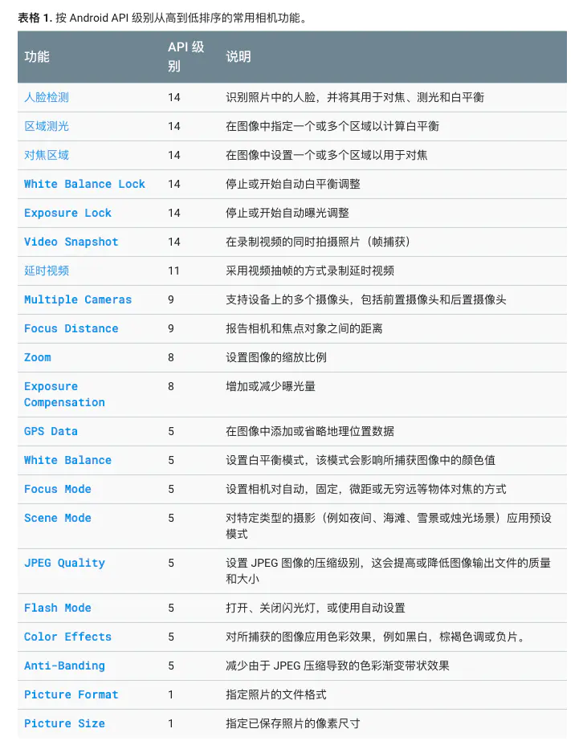

## 前言：

> 现在随着音视频的应用越来越多，直接使用系统原生相机进行拍照裁剪和拍视频，已经不能满足需求了。 需要通过Camera API进行自定义相机开发，满足一些复杂的业务场景，开篇先介绍Camera的基础知识，为后面Camera开发提供支持。

## 一、基础知识

Android Framework提供Camera API来实现拍照与录制视频的功能，目前Android有三类API：

- Camera 此类是用于控制设备相机的旧版 API，现已弃用，在Android5.0以下使用
- Camera2 此软件包是用于控制设备相机的主要 API，Android5.0以上使用
- CameraX 基于Camera 2 API封装，简化了开发流程，并增加生命周期控制

## 二、相关开发类

- android.hardware.camera2 控制相机的核心API，使用它可以实现拍照和录制视频的功能。
- Camera 此类是用于控制设备相机的旧版 API，现已弃用。
- SurfaceView 此类用于向用户呈现实时相机预览。
- TextureView 也是用于实时相机预览，Android4.0之后引入
- MediaRecorder 用于录制视频
- MediaStore.ACTION_IMAGE_CAPTURE 或 MediaStore.ACTION_VIDEO_CAPTURE 的 Intent 操作类型可用于捕获图像或视频，而无需直接使用
  Camera 对象。

## 三、术语

- ISO(感光度)
  CMOS（或胶卷）对光线的敏感程度，用ISO100的胶卷，相机2秒可以正确曝光的话，同样光线条件下用ISO200的胶卷只需要1秒即可，用ISO400则只要0.5秒。
  常见的标准：ISO100，ISO200，ISO400
- 曝光时间 曝光时间是为了将光投射到相机感光片上，相机快门所要打开至关闭的时间
- 光圈 用来控制光线透过镜头，进入相机内感光面光量的装置
- 焦距  
  指的是平行的光线穿过镜片后，所汇集的焦点至镜片间之距离。 数值越小，代表可以拍摄的角度越广，数值越大，代表可以拍摄的角度越小
- 景深 拍摄时，当镜头聚集于某个被摄体时，这个被摄体就能在相机上结成清晰影像。使被摄体产生较为清晰影像的纵深的范围叫景深
- 测光 测光模式：中央平均测光(average metering)、中央局部测光、点测光(spot metering)、多点测光、评价测光
- 自动曝光(Auto Exposure)
  相机根据光线条件自动来调整曝光时间等来确定曝光量
- 对焦 对焦模式：自动对焦 AE(Auto Focus)、手动对焦 MF(Manual Focus)
  自动对焦分为对比度对焦(contrast)、相位对焦(PDAF: Phase Detection Auto Focus)和混合对焦(hybrid)
- 闪光灯(Flashlight)
  通过闪光灯打闪照亮物体来达到拍出清晰图片的目的
- ScreenFlash 通过屏幕打闪，照亮周围物体，拍出高清图片
- 高动态范围图像(HDR)
  HDR全称是High-Dynamic Range，即高动态范围图像技术。在拍照过程中开启HDR，可以让原先的暗场景变得更明亮更通透。
- 零延时拍照(ZSD)
  为了减少拍照延时,让拍照&回显瞬间完成的一种技术
- 连拍(ContinuousShot)
  通过节约数据传输时间来捕捉摄影时机
- 预览大小(PreviewSize)
  相机预览图片的大小
- 拍照大小(PictureSize)
  拍照生成图片的大小
- 自动白平衡(Auto white balance)
  AWB(Auto white balance)，自动白平衡是相机的默认设置，相机中有一结构复杂的矩形图，它可决定画面中的白平衡基准点，以此来达到白平衡调校
- 对比度  
  图像最亮和最暗之间的区域之间的比率，比值越大，从黑到白的渐变层次就越多，从而色彩表现越丰富
- 饱和度 指色彩的鲜艳程度
- 锐角 是反映图像平面清晰度和图像边缘锐利程度的一个指标

## 四、相机功能

Android 支持多种相机功能，您可使用相机应用控制这些功能，如图片格式、闪光模式、对焦设置等等。 通过Camera.Parameters可以设置大部分的功能，下面介绍几个重要功能：

- 区域测光和对焦
- 人脸检测
- 延时视频

## 五、区域测光和对焦

从 Android 4.0（API 级别 14）开始，通过Camera.Parameters来确定对焦或亮度设置的区域，然后进行拍照或者录像

## 六、人脸检测

这个和真正的人脸识别是不一样的 ，这里仅仅是检测人脸。 通过照片分析，检测照片中是否包含人脸，使用人脸识别技术来识别人脸并计算照片设置

## 七、延时视频

延时视频功能允许用户将间隔几秒钟或几分钟拍摄的图片串联起来，创建视频剪辑。使用MediaRecorder录制时间流逝片段的图像。

其他重要功能API：

[原文地址](https://www.jianshu.com/p/65035467de7e)