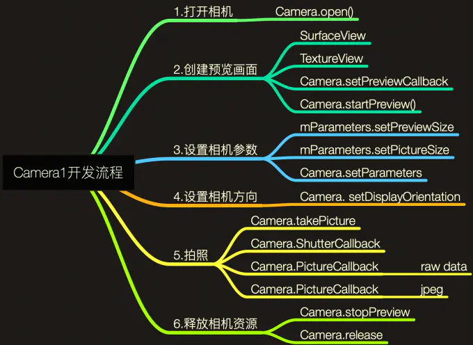
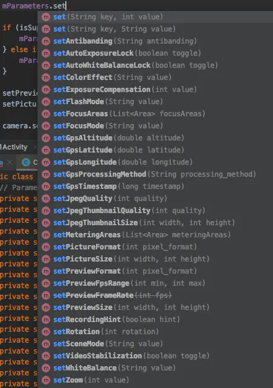

## 前言

> Android Camera API和Android版本一样，也是碎片化比较严重，所以Google官方推出了CameraView，提供给开发者参考和学习，
> 现在最新的可以使用Jetpack CameraX来开发，大大简化了开发的复杂度。本系列从Camera1->Camera2->CameraView->CameraX，
> 一步步讲解Camera的进化过程，本篇先介绍Camera1的使用。

相机开发的流程：

- 检测设备摄像头，打开相机
- 创建预览画面，显示实时预览画面
- 设置相机参数，进行拍照监听
- 监听中，保存图片资源或者直接操作原始数据
- 释放相机资源

上面的是基本的相机开发流程，不同的Camera API在实现上虽然会有不同，但整体流程上还是统一的。

## 一、权限声明和开发流程

### 1.1 权限声明

```xml

<uses-feature android:name="android.hardware.camera" android:required="true" />

<uses-permission android:name="android.permission.CAMERA" />
```

### 1.2 动态申请权限

相机必须声明CAMERA权限，在Android6.0上，你还需要在代码中动态申请权限

```c
ActivityCompat.requestPermissions(this, new String[]{Manifest.permission.CAMERA},
                    REQUEST_CAMERA_PERMISSION);
```

### 1.3 开发流程



## 二、相机预览的具体代码实现

### 2.1 初始化相机参数

```c
    /**
     * 初始化相机信息
     */
    private void initCameraInfo() {
        int numberOfCameras = Camera.getNumberOfCameras();// 获取摄像头个数
        for (int cameraId = 0; cameraId < numberOfCameras; cameraId++) {
            Camera.CameraInfo cameraInfo = new Camera.CameraInfo();
            Camera.getCameraInfo(cameraId, cameraInfo);
            if (cameraInfo.facing == Camera.CameraInfo.CAMERA_FACING_BACK) {
                // 后置摄像头信息
                mBackCameraId = cameraId;
                mBackCameraInfo = cameraInfo;
            } else if (cameraInfo.facing == Camera.CameraInfo.CAMERA_FACING_FRONT) {
                // 前置摄像头信息
                mFrontCameraId = cameraId;
                mFrontCameraInfo = cameraInfo;
            }
        }
    }
```

### 2.2 打开相机

```c
    /**
     * 打开相机
     *
     * @param cameraId
     */
    public void openCamera(int cameraId) {
        //打开相机
        mCamera = Camera.open(cameraId);
        mCameraId = cameraId;
        mCameraInfo = cameraId == mFrontCameraId ? mFrontCameraInfo : mBackCameraInfo;
    }
```

打开相机有两个方法，其本质都是是根据cameraId创建一个Camera对象实例。

```c
    public static Camera open(int cameraId) {
        return new Camera(cameraId);
    }

    /**
     * 这里会检查可用的摄像头，默认使用的CameraInfo.CAMERA_FACING_BACK后置摄像头
     */
    public static Camera open() {
        int numberOfCameras = getNumberOfCameras();
        CameraInfo cameraInfo = new CameraInfo();
        for (int i = 0; i < numberOfCameras; i++) {
            getCameraInfo(i, cameraInfo);
            if (cameraInfo.facing == CameraInfo.CAMERA_FACING_BACK) {
                return new Camera(i);
            }
        }
        return null;
    }
```

### 2.3 创建预览画面

这里使用的是SurfaceView

```c
    private CameraHelper mCameraHelper;
    private SurfaceView mSurfaceView;
    
    mSurfaceView = findViewById(R.id.camera_preview);
    SurfaceHolder surfaceHolder = mSurfaceView.getHolder();
    surfaceHolder.addCallback(new SurfaceHolder.Callback() {
        @Override
        public void surfaceCreated(SurfaceHolder holder) {
            Log.d(TAG, "surfaceCreated: ");
            startPreview(holder);//让mSurfaceView和Camera产生关联
        }

        @Override
        public void surfaceChanged(SurfaceHolder holder, int format, int width, int height) {
            Log.d(TAG, "surfaceChanged: ");
        }

        @Override
        public void surfaceDestroyed(SurfaceHolder holder) {
            Log.d(TAG, "surfaceDestroyed: ");
            stopPreview();
        }
    });
    
  /**
     * 开始预览
     *
     * @param surfaceHolder
     */
    public void startPreview(SurfaceHolder surfaceHolder) {
        try {
            mSurfaceHolder = surfaceHolder;
            //设置实时预览
            mCamera.setPreviewDisplay(mSurfaceHolder);
            //这里可以设置监听预览数据的回调，一般返回的是YUV格式中类型为NV21的图像数据
            mCamera.setPreviewCallback(new Camera.PreviewCallback() {
                @Override
                public void onPreviewFrame(byte[] data, Camera camera) {

                }
            });
            //Orientation
            // 设置相机方向
            mCamera.setDisplayOrientation(getCameraDisplayOrientation());
            //开始预览
            mCamera.startPreview();
        } catch (Exception e) {
            e.printStackTrace();
        }
    }

    /**
     * 停止预览
     */
    public void stopPreview() {
        if (mCamera != null) {
            mCamera.stopPreview();
        }
    }
    
    /**
     * 设置相机参数
     */
    public void setCameraParameters() {
        if (null == mCamera) {
            return;
        }
        Camera.Parameters parameters = mCamera.getParameters();
        parameters.setPreviewFormat(ImageFormat.NV21); //default

        if (isSupportFocus(Camera.Parameters.FOCUS_MODE_CONTINUOUS_PICTURE)) {
            parameters.setFocusMode(Camera.Parameters.FOCUS_MODE_CONTINUOUS_PICTURE);
        } else if (isSupportFocus(Camera.Parameters.FOCUS_MODE_AUTO)) {
            parameters.setFocusMode(Camera.Parameters.FOCUS_MODE_AUTO);
        }

        //设置预览图片大小
//        parameters.setPreviewSize(int width, int height);
        //设置图片大小
//        parameters.setPictureSize(int width, int height);

          mCamera.setParameters(parameters);
    }
}

```

## 三、常见的相机参数设置



- setFocusMode 设置对焦模式

FOCUS_MODE_AUTO：自动对焦  
FOCUS_MODE_INFINITY：无穷远  
FOCUS_MODE_MACRO：微距  
FOCUS_MODE_FIXED：固定焦距  
FOCUS_MODE_EDOF：景深扩展  
FOCUS_MODE_CONTINUOUS_PICTURE：持续对焦(针对照片)  
FOCUS_MODE_CONTINUOUS_VIDEO：(针对视频)

- setPreviewSize 设置预览图片大小

- setPreviewFormat 设置支持的颜色编码格式：

ImageFormat.NV16  
ImageFormat.NV21  
ImageFormat.YUY2  
ImageFormat.YV12  
ImgaeFormat.RGB_565  
ImageFormat.JPEG

如果不设置，默认返回NV21的数据

- setPictureSize 设置保存图片的大小

- setPictureFormat 设置保存图片的格式，格式和setPreviewFormat一样

- setDisplayOrientation 设置相机预览画面旋转的角度，degress取值0，90，180，270

- setPreviewDisplay 设置实时预览SurfaceHolder

- setPreviewCallback 监听相机预览数据回调

- setParameters 设置相机的Parameters

其他一些设置，大家可以查看Android文档进行相应的设置

## 四、拍照

```c
private void takePicture() {
    if (null != mCamera) {
        mCamera.takePicture(new Camera.ShutterCallback() {
            @Override
            public void onShutter() {

            }
        }, new Camera.PictureCallback() {
            @Override
            public void onPictureTaken(byte[] data, Camera camera) {
                //base data
            }
        }, new Camera.PictureCallback() {
            @Override
            public void onPictureTaken(final byte[] data, Camera camera) {
                mCamera.startPreview();
                //save data
            }
        });
    }
}
```

- shutter(ShutterCallback)：快门按下后的回调
- raw(PictureCallback)：raw图像数据
- jpeg(PictureCallback)：jpeg图像生成以后的回调

## 五、释放相机资源

在使用完成后，onPause或者onDestory中进行相机资源的释放

```c
private void releaseCamera() {
    if (null != mCamera) {
        mCamera.stopPreview();
        mCamera.stopFaceDetection();
        mCamera.setPreviewCallback(null);
        mCamera.release();
        mCamera = null;
    }
}
```

- stopPreview：停止预览
- release：释放资源

## 完整的代码实现

```java
public class MainActivity extends AppCompatActivity {
    public static final String TAG = "MainActivity======";

    private CameraHelper mCameraHelper;
    private SurfaceView mSurfaceView;
    private Button mBtnOpenCamera;

    @Override
    protected void onCreate(Bundle savedInstanceState) {
        super.onCreate(savedInstanceState);
        setContentView(R.layout.activity_main);
        initView();
        mCameraHelper = new CameraHelper(this);
        openCamera();
        String[] perms = {Manifest.permission.CAMERA, Manifest.permission.WRITE_EXTERNAL_STORAGE};
        if (checkSelfPermission(perms[0]) == PackageManager.PERMISSION_DENIED) {
            requestPermissions(perms, 200);
        }
    }

    private void initView() {
        mSurfaceView = findViewById(R.id.camera_preview);
        mBtnOpenCamera = findViewById(R.id.btn_open_camera);
        findViewById(R.id.btn_open_camera).setOnClickListener(new View.OnClickListener() {
            @Override
            public void onClick(View v) {
                String text = mBtnOpenCamera.getText().toString();
                if ("关闭相机".equals(text)) {
                    mBtnOpenCamera.setText("打开相机");
                    mSurfaceView.setVisibility(View.INVISIBLE);
                } else {
                    mBtnOpenCamera.setText("关闭相机");
                    mSurfaceView.setVisibility(View.VISIBLE);

                }
            }
        });
        findViewById(R.id.btn_switch_camera).setOnClickListener(new View.OnClickListener() {
            @Override
            public void onClick(View v) {
                mSurfaceView.setVisibility(View.INVISIBLE);
                mCameraHelper.switchCamera();
                mSurfaceView.setVisibility(View.VISIBLE);
            }
        });
        SurfaceHolder surfaceHolder = mSurfaceView.getHolder();
        surfaceHolder.addCallback(new SurfaceHolder.Callback() {
            @Override
            public void surfaceCreated(SurfaceHolder holder) {
                Log.d(TAG, "surfaceCreated: ");
                mCameraHelper.startPreview(holder);//让mSurfaceView和Camera产生关联
            }

            @Override
            public void surfaceChanged(SurfaceHolder holder, int format, int width, int height) {
                Log.d(TAG, "surfaceChanged: ");
            }

            @Override
            public void surfaceDestroyed(SurfaceHolder holder) {
                Log.d(TAG, "surfaceDestroyed: ");
                mCameraHelper.stopPreview();
            }
        });
    }


    @Override
    protected void onDestroy() {
        super.onDestroy();
        mCameraHelper.releaseCamera();
    }

    private void openCamera() {
        if (ContextCompat.checkSelfPermission(this, Manifest.permission.CAMERA) == PackageManager.PERMISSION_GRANTED) {
            mCameraHelper.openCamera(mCameraHelper.getFrontCameraId());
        }
    }


}
```

```java
public class CameraHelper {

    private Activity mActivity;
    //后置摄像头信息
    private int mBackCameraId;
    private Camera.CameraInfo mBackCameraInfo;
    //前置摄像头信息
    private int mFrontCameraId;
    private Camera.CameraInfo mFrontCameraInfo;
    Camera mCamera;
    int mCameraId;
    private Camera.CameraInfo mCameraInfo;
    private SurfaceHolder mSurfaceHolder;

    public CameraHelper(Activity activity) {
        this.mActivity = activity;
        initCameraInfo();
    }

    public int getBackCameraId() {
        return mBackCameraId;
    }

    public int getFrontCameraId() {
        return mFrontCameraId;
    }

    /**
     * 初始化相机信息
     */
    private void initCameraInfo() {
        int numberOfCameras = Camera.getNumberOfCameras();// 获取摄像头个数
        for (int cameraId = 0; cameraId < numberOfCameras; cameraId++) {
            Camera.CameraInfo cameraInfo = new Camera.CameraInfo();
            Camera.getCameraInfo(cameraId, cameraInfo);
            if (cameraInfo.facing == Camera.CameraInfo.CAMERA_FACING_BACK) {
                // 后置摄像头信息
                mBackCameraId = cameraId;
                mBackCameraInfo = cameraInfo;
            } else if (cameraInfo.facing == Camera.CameraInfo.CAMERA_FACING_FRONT) {
                // 前置摄像头信息
                mFrontCameraId = cameraId;
                mFrontCameraInfo = cameraInfo;
            }
        }
    }

    /**
     * 打开相机
     *
     * @param cameraId
     */
    public void openCamera(int cameraId) {
        //打开相机
        mCamera = Camera.open(cameraId);
        mCameraId = cameraId;
        mCameraInfo = cameraId == mFrontCameraId ? mFrontCameraInfo : mBackCameraInfo;
    }

    /**
     * 切换相机
     */
    public void switchCamera() {
        if (mCamera == null) {
            return;
        }
        releaseCamera();
        if (mCameraId == mFrontCameraId) {
            openCamera(mBackCameraId);
        } else {
            openCamera(mFrontCameraId);
        }
    }

    /**
     * 开始预览
     *
     * @param surfaceHolder
     */
    public void startPreview(SurfaceHolder surfaceHolder) {
        try {
            mSurfaceHolder = surfaceHolder;
            //设置实时预览
            mCamera.setPreviewDisplay(mSurfaceHolder);
            //这里可以设置监听预览数据的回调，一般返回的是YUV格式中类型为NV21的图像数据
            mCamera.setPreviewCallback(new Camera.PreviewCallback() {
                @Override
                public void onPreviewFrame(byte[] data, Camera camera) {

                }
            });
            //Orientation
            // 设置相机方向
            mCamera.setDisplayOrientation(getCameraDisplayOrientation());
            //开始预览
            mCamera.startPreview();
        } catch (Exception e) {
            e.printStackTrace();
        }
    }

    /**
     * 停止预览
     */
    public void stopPreview() {
        if (mCamera != null) {
            mCamera.stopPreview();
        }
    }

    /**
     * 释放相机资源
     */
    public void releaseCamera() {
        if (mCamera != null) {
            mCamera.stopPreview();
            mCamera.stopFaceDetection();
            mCamera.setPreviewCallback(null);
            mCamera.release();
            mCamera = null;
        }
    }

    /**
     * 设置相机参数
     */
    public void setCameraParameters() {
        if (null == mCamera) {
            return;
        }
        Camera.Parameters parameters = mCamera.getParameters();
        parameters.setPreviewFormat(ImageFormat.NV21); //default

        if (isSupportFocus(Camera.Parameters.FOCUS_MODE_CONTINUOUS_PICTURE)) {
            parameters.setFocusMode(Camera.Parameters.FOCUS_MODE_CONTINUOUS_PICTURE);
        } else if (isSupportFocus(Camera.Parameters.FOCUS_MODE_AUTO)) {
            parameters.setFocusMode(Camera.Parameters.FOCUS_MODE_AUTO);
        }

        //设置预览图片大小
//        parameters.setPreviewSize(int width, int height);
        //设置图片大小
//        parameters.setPictureSize(int width, int height);

        mCamera.setParameters(parameters);
    }

    private boolean isSupportFocus(String focusModel) {
        if (mCamera != null) {
            Camera.Parameters parameters = mCamera.getParameters();
            List<String> supportList = parameters.getSupportedFocusModes();
            return supportList.contains(focusModel);
        }
        return false;
    }

    private int getCameraDisplayOrientation() {
        int roration = mActivity.getWindowManager().getDefaultDisplay().getRotation();
        // 屏幕显示方向角度(相对局部坐标Y轴正方向夹角)
        int degrees = 0;
        switch (roration) {
            case Surface.ROTATION_0:
                degrees = 0;
                break;
            case Surface.ROTATION_90:
                degrees = 90;
                break;
            case Surface.ROTATION_180:
                degrees = 180;
                break;

            case Surface.ROTATION_270:
                degrees = 270;
                break;
        }
        int result;
        if (mCameraInfo.facing == Camera.CameraInfo.CAMERA_FACING_FRONT) {
            result = (mCameraInfo.orientation + degrees) % 360;
            result = (360 - result) % 360;
        } else {
            result = (mCameraInfo.orientation - degrees + 360) % 360;
        }
        // 相机需要校正的角度
        return result;
    }


}
```

