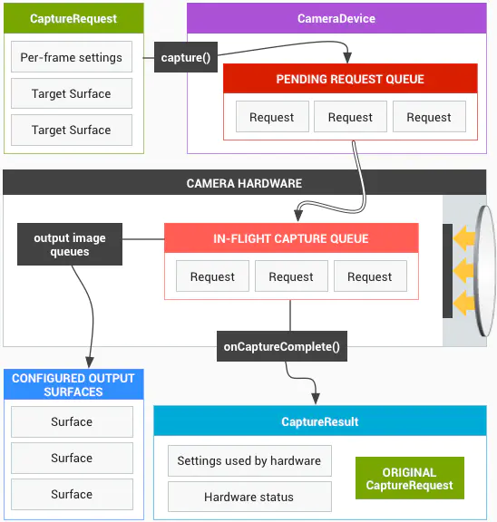

## 前言

> 上篇文章介绍了Camera1的使用，本篇介绍Camera2的使用。 Camera2(android.hardware.camera2)是从 Android 5.0 L 版本开始引入的，  
> 并且废弃了旧的相机框架Camera1(android.hardware.Camera)。 相比于Camera1，Camera2架构上也发生了变化，API上的使用难度也增加了。
> Camera2将相机设备模拟成一个管道，它按顺序处理每一帧的请求并返回请求结果给客户端。

## 设计框架

重新设计 Android Camera API 的目的在于大幅提高应用对于 Android 设备上的相机子系统的控制能力，同时重新组织 API，提高其效率和可维护性。
在CaptureRequest中设置不同的Surface用于接收不同的图片数据，最后从不同的Surface中获取到图片数据和包含拍照相关信息的CaptureResult。
