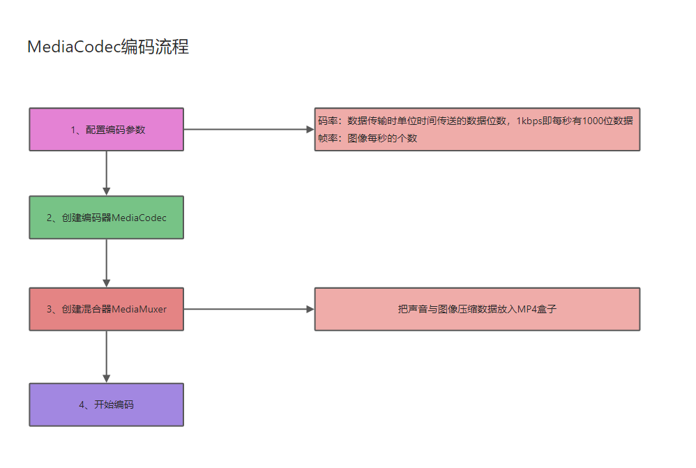

## 一、开发前的准备

### 1.1 知识储备

码率(比特率) bps (Bit Per Second)

- 视频码率就是数据传输时单位时间传送的数据位数，一般我们用的单位是kbps即千位每秒。通俗一点的理解就是取样率，单位时间内取样率越大，精度就越高，处理出来的文件就越接近原始文件。
- 码率越高，每秒传送数据就越多，画质就越清晰，视频文件占用空间也越大

帧率 fps (Frame Per Second)

- 是以帧称为单位的位图图像连续出现在显示器上的频率（速率）
- 视频每秒传输的帧数（画面数），每秒帧数越多，显示的画面就越流畅，但对显卡（GPU）的要求也越高。更多参考 fps-百度百科。

YUV 颜色编码

- 是一种颜色编码方法，常使用在各个视频处理组件中。
- YUV在对照片或视频编码时，考虑到人类的感知能力，允许降低色度的带宽。 YUV是编译true-color颜色空间（color space）的种类，Y'UV, YUV,
  YCbCr，YPbPr等专有名词都可以称为YUV，彼此有重叠。“Y”表示明亮度（Luminance或Luma），也就是灰阶值，“U”和“V”表示的则是色度（Chrominance或Chroma），作用是描述影像色彩及饱和度，用于指定像素的颜色。

## 1.2 Android摄像头图像采集流程以及相关API

- 构建预览画布：使用SurfaceView或者TextureView
- 打开相机：Camera.Open
- 设置参数：Camera.Parameters
- 设置预览数据回调 PreviewCallBack
- 设置预览画布并启动：SetPreviewTexture/StartPreview
- 释放相机：StopPreview/release

### 1.3 Android自带的多媒体编解码器MediaCodec和一些第三方音视频编解码开源库

MedicaCodec类可用于访问Android底层的多媒体编解码器，例如，编码器/解码器组件。它是Android底层多媒体支持基础架构的一部分。  
Android底层多媒体模块采用的是OpenMax框架，任何Android底层编解码模块的实现，都必须遵循OpenMax标准。谷歌官方默认提供了
一系列的软件编解码器，而硬件编解码功能，则需要由芯片厂商依照OpenMax框架标准来完成，所以，一般采用不同芯片型号的手机， 硬件编解码的实现和性能是不同的。


除了MedicaCodec这个Android自带的编解码器以外，**FFmpeg**开源库也能帮我们实现软编解码的功能，我们也需要着重了解。
另外作为一名合格优秀的音视频开发者，我们还应该尽可能的去熟悉以下的几种音视频处理的开源库。

**OpenGl**开源库、**OpenSL**开源库、**OpenCv**开源库

### 1.4 MediaCodec编码流程



## 二、编码实战

### 1.1 打开相机，预览图像

MainActivity代码如下所示：

```java
public class MainActivity extends AppCompatActivity implements Camera.PreviewCallback {

    private Button mBtnRecord;
    private TextureView mTextureView;
    private CameraHelper mCameraHelper;
    private VideoCodec mVideoCodec;

    @Override
    protected void onCreate(Bundle savedInstanceState) {
        super.onCreate(savedInstanceState);
        setContentView(R.layout.activity_main);
        mCameraHelper = new CameraHelper(640, 480);
        mCameraHelper.setPreviewCallback(this);
        mVideoCodec = new VideoCodec();
        mBtnRecord = findViewById(R.id.btn_record);
        mTextureView = findViewById(R.id.textureView);
        mTextureView.setSurfaceTextureListener(new TextureView.SurfaceTextureListener() {
            @Override
            public void onSurfaceTextureAvailable(@NonNull SurfaceTexture surface, int width, int height) {
                mCameraHelper.startPreview(surface);
            }

            @Override
            public void onSurfaceTextureSizeChanged(@NonNull SurfaceTexture surface, int width, int height) {

            }

            @Override
            public boolean onSurfaceTextureDestroyed(@NonNull SurfaceTexture surface) {
                mCameraHelper.stopPreview();
                return true;
            }

            @Override
            public void onSurfaceTextureUpdated(@NonNull SurfaceTexture surface) {

            }
        });
        mBtnRecord.setOnClickListener(new View.OnClickListener() {
            @Override
            public void onClick(View v) {
                if (mVideoCodec.isRecording()) {
                    mBtnRecord.setText("开始录制");
                    mVideoCodec.stopRecording();
                } else {
                    mBtnRecord.setText("停止录制");
//                    String mp4Path = Environment.getExternalStorageState() + File.separator + "AAAAA.mp4";
                    String mp4Path = "/sdcard/AAAAA.mp4";
                    mVideoCodec.startRecording(mp4Path, mCameraHelper.getWidth(), mCameraHelper.getHeight(), 90);
                }
            }
        });
        if (Build.VERSION.SDK_INT >= Build.VERSION_CODES.M) {
            String[] perms = {Manifest.permission.CAMERA, Manifest.permission.WRITE_EXTERNAL_STORAGE};
            if (checkSelfPermission(perms[0]) == PackageManager.PERMISSION_DENIED) {
                requestPermissions(perms, 200);
            }
        }
        mVideoCodec.getSupportType();
    }

    @Override
    public void onPreviewFrame(byte[] data, Camera camera) {
        mVideoCodec.queueEncode(data);
    }

}
```


