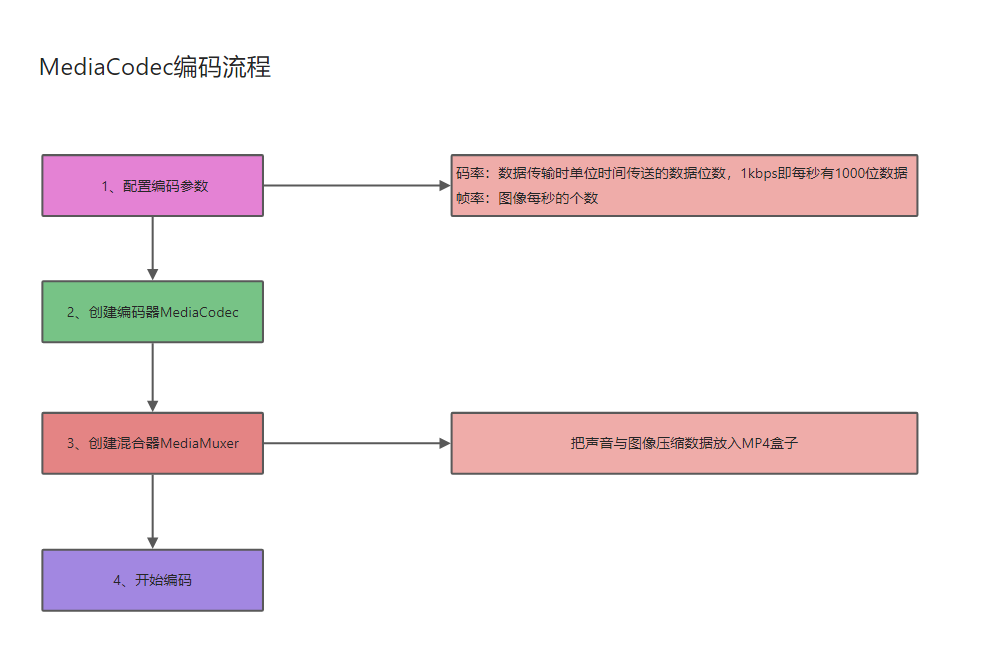

## 一、开发前的准备

### 1.1 知识储备

码率(比特率) bps (Bit Per Second)

- 视频码率就是数据传输时单位时间传送的数据位数，一般我们用的单位是kbps即千位每秒。通俗一点的理解就是取样率，单位时间内取样率越大，精度就越高，处理出来的文件就越接近原始文件。
- 码率越高，每秒传送数据就越多，画质就越清晰，视频文件占用空间也越大

帧率 fps (Frame Per Second)

- 是以帧称为单位的位图图像连续出现在显示器上的频率（速率）
- 视频每秒传输的帧数（画面数），每秒帧数越多，显示的画面就越流畅，但对显卡（GPU）的要求也越高。更多参考 fps-百度百科。

YUV 颜色编码

- 是一种颜色编码方法，常使用在各个视频处理组件中。
- YUV在对照片或视频编码时，考虑到人类的感知能力，允许降低色度的带宽。 YUV是编译true-color颜色空间（color space）的种类，Y'UV, YUV,
  YCbCr，YPbPr等专有名词都可以称为YUV，彼此有重叠。“Y”表示明亮度（Luminance或Luma），也就是灰阶值，“U”和“V”表示的则是色度（Chrominance或Chroma），作用是描述影像色彩及饱和度，用于指定像素的颜色。

## 1.2 Android摄像头图像采集流程以及相关API

- 构建预览画布：使用SurfaceView或者TextureView
- 打开相机：Camera.Open
- 设置参数：Camera.Parameters
- 设置预览数据回调 PreviewCallBack
- 设置预览画布并启动：SetPreviewTexture/StartPreview
- 释放相机：StopPreview/release

### 1.3 Android自带的多媒体编解码器MediaCodec和一些第三方音视频编解码开源库

MedicaCodec类可用于访问Android底层的多媒体编解码器，例如，编码器/解码器组件。它是Android底层多媒体支持基础架构的一部分。  
Android底层多媒体模块采用的是OpenMax框架，任何Android底层编解码模块的实现，都必须遵循OpenMax标准。谷歌官方默认提供了
一系列的软件编解码器，而硬件编解码功能，则需要由芯片厂商依照OpenMax框架标准来完成，所以，一般采用不同芯片型号的手机， 硬件编解码的实现和性能是不同的。


除了MedicaCodec这个Android自带的编解码器以外，**FFmpeg**开源库也能帮我们实现软编解码的功能，我们也需要着重了解。
另外作为一名合格优秀的音视频开发者，我们还应该尽可能的去熟悉以下的几种音视频处理的开源库。

**OpenGl**开源库、**OpenSL**开源库、**OpenCv**开源库

### 1.4 MediaCodec编码流程



## 二、编码实战

### 1.1 打开相机，预览图像

MainActivity代码如下所示：

```java
public class MainActivity extends AppCompatActivity implements Camera.PreviewCallback {

    private TextureView mTextureView;
    private CameraHelper mCameraHelper;

    @Override
    protected void onCreate(Bundle savedInstanceState) {
        super.onCreate(savedInstanceState);
        setContentView(R.layout.activity_main);
        mCameraHelper = new CameraHelper(640, 480);
        mCameraHelper.setPreviewCallback(this);
        mTextureView = findViewById(R.id.textureView);
        mTextureView.setSurfaceTextureListener(new TextureView.SurfaceTextureListener() {
            @Override
            public void onSurfaceTextureAvailable(@NonNull SurfaceTexture surface, int width, int height) {
                mCameraHelper.startPreview(surface);
            }

            @Override
            public void onSurfaceTextureSizeChanged(@NonNull SurfaceTexture surface, int width, int height) {

            }

            @Override
            public boolean onSurfaceTextureDestroyed(@NonNull SurfaceTexture surface) {
                mCameraHelper.stopPreview();
                return true;
            }

            @Override
            public void onSurfaceTextureUpdated(@NonNull SurfaceTexture surface) {

            }
        });
        if (Build.VERSION.SDK_INT >= Build.VERSION_CODES.M) {
            String[] perms = {Manifest.permission.CAMERA, Manifest.permission.WRITE_EXTERNAL_STORAGE};
            if (checkSelfPermission(perms[0]) == PackageManager.PERMISSION_DENIED) {
                requestPermissions(perms, 200);
            }
        }
    }

    @Override
    public void onPreviewFrame(byte[] data, Camera camera) {
    }
}
```

```xml
<?xml version="1.0" encoding="utf-8"?>
<RelativeLayout xmlns:android="http://schemas.android.com/apk/res/android"
    xmlns:tools="http://schemas.android.com/tools" android:layout_width="match_parent"
    android:layout_height="match_parent" tools:context=".MainActivity">

    <TextureView android:id="@+id/textureView" android:layout_width="match_parent"
        android:layout_height="match_parent" />

</RelativeLayout>
```

对Camera进行封装：
```java
public class CameraHelper implements Camera.PreviewCallback {

    public static final String TAG = "CameraHelper";
    private int width;
    private int height;
    private int mCameraId;
    private Camera mCamera;
    private Camera.PreviewCallback mPreviewCallback;
    private SurfaceTexture mSurfaceTexture;
    byte[] i420;
    byte[] buffer;

    public CameraHelper(int width, int height) {
        this.width = width;
        this.height = height;
        mCameraId = Camera.CameraInfo.CAMERA_FACING_BACK;
    }

    public void switchCamera() {
        if (mCameraId == Camera.CameraInfo.CAMERA_FACING_BACK) {
            mCameraId = Camera.CameraInfo.CAMERA_FACING_FRONT;
        } else {
            mCameraId = Camera.CameraInfo.CAMERA_FACING_BACK;
        }
        stopPreview();
        startPreview(mSurfaceTexture);
    }

    public int getCameraId() {
        return mCameraId;
    }

    public int getWidth() {
        return width;
    }

    public int getHeight() {
        return height;
    }

    /**
     * 开始相机预览
     *
     * @param surfaceTexture
     */
    public void startPreview(SurfaceTexture surfaceTexture) {
        stopPreview();
        try {
            mSurfaceTexture = surfaceTexture;
            //获取Camera对象
            mCamera = Camera.open(mCameraId);
            //获取Camera的属性
            Camera.Parameters parameters = mCamera.getParameters();
            //设置预览数据格式为NV21
            parameters.setPreviewFormat(ImageFormat.NV21);
            boolean isSupportSize = false;
            List<Camera.Size> supportedPreviewSizes = parameters.getSupportedPreviewSizes();
            for (Camera.Size supportedPreviewSize : supportedPreviewSizes) {
                if (supportedPreviewSize.width == width && supportedPreviewSize.height == height) {
                    isSupportSize = true;
                    break;
                }
            }
            if (!isSupportSize) {
                Camera.Size size = supportedPreviewSizes.get(0);
                width = size.width;
                height = size.height;
            }
            //设置摄像头宽高
            parameters.setPreviewSize(width, height);
            parameters.setFocusMode(Camera.Parameters.FOCUS_MODE_CONTINUOUS_VIDEO);
            mCamera.setDisplayOrientation(90);
            //设置摄像头、图像传感器的角度、方向
            mCamera.setParameters(parameters);
            buffer = new byte[width * height * 3 / 2];
            //数据缓存区
            mCamera.addCallbackBuffer(buffer);
            mCamera.setPreviewCallbackWithBuffer(this);
            mCamera.setPreviewTexture(surfaceTexture);
            mCamera.startPreview();
        } catch (Exception e) {
            e.printStackTrace();
        }
    }


    /**
     * 停止相机预览
     */
    public void stopPreview() {
        if (mCamera != null) {
            mCamera.setPreviewCallback(null);
            mCamera.toString();
            mCamera.release();
            mCamera = null;
        }
    }


    public void setPreviewCallback(Camera.PreviewCallback mPreviewCallback) {
        this.mPreviewCallback = mPreviewCallback;
        i420 = new byte[width * height * 3 / 2];
    }

    @Override
    public void onPreviewFrame(byte[] data, Camera camera) {
        if (mPreviewCallback != null) {
            NV21ToI420(data, i420, width, height);
            mPreviewCallback.onPreviewFrame(i420, camera);
        }
        mCamera.addCallbackBuffer(buffer);
    }

    /**
     * @param nv21   YYYYYYYYYYYYYYYY VUVUVUVU
     * @param i420   YYYYYYYYYYYYYYYY UUUUVVVV
     * @param width  图像宽度
     * @param height 图像高度
     */
    public void NV21ToI420(byte[] nv21, byte[] i420, int width, int height) {
        int frameSize = width * height;
        System.arraycopy(nv21, 0, i420, 0, frameSize);
        int index = frameSize;
        for (int i = frameSize; i < nv21.length; i = i + 2) {
            //U
            i420[index++] = nv21[i + 1];
        }
        for (int i = frameSize; i < nv21.length; i = i + 2) {
            //V
            i420[index++] = nv21[i];
        }
    }


    /**
     * @param nv21   YYYYYYYYYYYYYYYY VUVUVUVU
     * @param nv12   YYYYYYYYYYYYYYYY UVUVUVUV
     * @param width  图像宽度
     * @param height 图像高度
     */
    public static void NV21ToNV12(byte[] nv21, byte[] nv12, int width, int height) {
        if (nv21 == null || nv12 == null) {
            return;
        }
        int frameSize = width * height;
        System.arraycopy(nv21, 0, nv12, 0, frameSize);
        for (int i = 0; i < frameSize / 2; i += 2) {
            // U
            nv12[frameSize + i * 2] = nv21[frameSize + i + 1];
            // V
            nv12[frameSize + i * 2 + 1] = nv21[frameSize + i];
        }
    }


}
```


