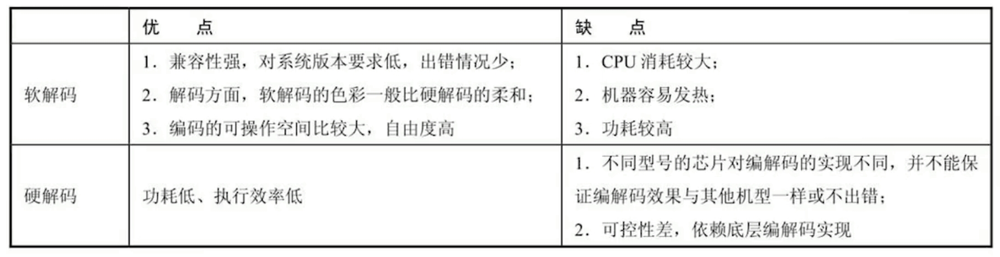

## 一、图像原理

### 1.1 视频文件是什么

视频文件格式是指视频保存的一种格式，各种不同后缀的视频文件，其实就是使用各种不同的数据格式来封装视频的容器。

### 1.2 为什么要编码

视频是连续的图像序列，由连续的帧构成，一帧即为一幅图像，由于人眼的视觉暂留效应，当帧序列以一定的速度播放时，我们看到的就是动作连续的视频。  
这么多连续的图像格式如果不经过编码，数据量就会非常大。比如一个A.rgb文件可能有100Mb，转化为A.h264则可能只有500kb大小。
编码的目的，其实是为了压缩，各种视频编码方式，都是为了让视频体积变大更小，有利于存储和传输。编码的核心思想就是去除冗余信息。

- 空间冗余：图像内部相邻像素之间存在较强的相关性造成的冗余
- 时间冗余：视频图像序列中的不同帧之间的相关性所造成的冗余
- 视觉冗余：是指人眼不能感知活不敏感的那部分图像信息
- 信息熵冗余：人们用于表达某一信息所需要的比特数总比理论上表示该信息所需的最少比特数要大，他们之间的差距就是信息熵冗余，也称编码冗余，
- 知识冗余：是指在有些图像中还包含与某些验证知识油管的信息

### 1.3 如何编码（IPB帧）

- I帧：帧内编码帧，也叫关键帧，I帧可以看做是一个图像经过压缩之后的产物，可以单独解码出一个完整的图像。
- P帧：前向预测编码帧，记录了本帧和之前的一个关键帧(或P帧)的差别，解码时需要用到之前缓存的画面叠加上本帧定义的差别，生成最终画面。
- B帧：双向预测编码帧，记录了本帧和前后帧的差别，解码时既需要参考前面一个I帧(P帧)，同时也需要后面的P帧才能生成一张完整的图像

## 二、视频编码

### 2.1 视频编码

所谓视频编码就是指通过特定的压缩技术，将某个视频格式文件转化为另外一种视频格式文件的方式，视频传输中最重要的编码标准有国际电联(ITU-T国际电子联盟)的H261、H263、H264等。
运动静止图像专家组(有ISO国际标准化组织与IEC国际电子委员会与1988年联合成立)的MPEG系列标准MPEG1、MPEG2、MPEG4 AVC等。

其中ITU-T H.264/MPEG-4 AVC是ITU-T与ISO/IEC联手合作指定的新标准，ITU-T方面称之为H.264。但ISO/IEC的则将这个新标准归纳为MPEG系列，称为MPEG-4
AVC。

而H.265则被视为是ITU-T H.264/MPEG-4 AVC标准的继任者，又称为高效率视频编码(High EFFiciency Video Coding，简称HEVC)

### 2.2 H264码流分析

H264码流文件分两层。

- 1、VCL(Video Coding Layer，视频编码层)：负责高效的视频内容表示，VCL数据既编码处理的输出，它表示被压缩编码后的视频数据序列
- 2、NAL(Network Abstraction Layer，网络提取层)：负责以网络所要求的恰当的方式对数据进行打包和传输，是传输层。 不管在本地播放还是网络播放，都要通过这层来传输。

### 2.3 片和宏块

一帧图片经过H.264编码之后，就被编码为一个或多个片(slice)，每片包含整个宏块（至少一个宏块，最多包含整个图片宏块），NAL单元就是装载着这些片(slice)的载体。

### 2.4 Annexb格式

一般H.264编码器的默认输出为：起始码+NALU（NAL单元）。起始码为：0x00000001或者0x000001。 每个NALU包含1个字节的NAL
Header与若干整数节的负荷数据EBSP构成。

| NAL Header | EBSP |NAL Header | EBSP |

其中NAL Header只占用1个字节，次字节低5位表示NALU类型

## 三、视频采集编码格式

### 3.1 RGB颜色编码

- 红(Red)绿(Green)蓝(Blue)，光的三原色

### 3.2 YUV颜色编码

- YUV主要用于优化彩色视频信号的传递，与RGP相比，YUV只需要占用少量的频宽(RGB需要三个独立的视频信号同时传递)。
- YUV中Y代表灰度(色调饱和度)，也可以叫YCbCr。如果只有Y数据，那么表示的图像就是黑白的。

使用YUV格式才能极大的去除冗余数据，人眼对亮点信息更敏感，对色度敏感度不高。也就是说可以压缩UV数据，而人眼难以发现。
所以压缩算法的第一步，往往先把RGB数据转化为YUV数据，对Y少压缩一点，对UV多压缩一点，以平衡图像效果和压缩率。 这也是为什么编码选择使用YUV而非RGB

Gray = R*040 +G*0.59+B*0.11

### 3.3 NV21与I420

- YUV因为采样和数据排列方式的不同，又分为不同的存储格式。
- 一般的Android摄像头输出为：NV21类型的YUB格式，而I420类型的YUV格式则是绝大多数编解码器的默认输入输出格式。

## 四、Android编码实战

### 3.1 知识预备

码率(比特率) bps (Bit Per Second)

- 视频码率就是数据传输时单位时间传送的数据位数，一般我们用的单位是kbps即千位每秒。通俗一点的理解就是取样率，单位时间内取样率越大，精度就越高，处理出来的文件就越接近原始文件。
- 码率越高，每秒传送数据就越多，画质就越清晰，视频文件占用空间也越大

帧率 fps (Frame Per Second)

- 是以帧称为单位的位图图像连续出现在显示器上的频率（速率）
- 视频每秒传输的帧数（画面数），每秒帧数越多，显示的画面就越流畅，但对显卡（GPU）的要求也越高。更多参考 fps-百度百科。

YUV 颜色编码

- 是一种颜色编码方法，常使用在各个视频处理组件中。
- YUV在对照片或视频编码时，考虑到人类的感知能力，允许降低色度的带宽。 YUV是编译true-color颜色空间（color space）的种类，Y'UV, YUV,
  YCbCr，YPbPr等专有名词都可以称为YUV，彼此有重叠。“Y”表示明亮度（Luminance或Luma），也就是灰阶值，“U”和“V”表示的则是色度（Chrominance或Chroma），作用是描述影像色彩及饱和度，用于指定像素的颜色。

### 3.2 Android摄像头图像采集流程以及相关API

- 构建预览画布：使用SurfaceView或者TextureView
- 打开相机：Camera.Open
- 设置参数：Camera.Parameters
- 设置预览数据回调 PreviewCallBack
- 设置预览画布并启动：SetPreviewTexture/StartPreview
- 释放相机：StopPreview/release

### 3.2 多媒体编解码器MediaCodec

MedicaCodec类可用于访问Android底层的多媒体编解码器，例如，编码器/解码器组件。它是Android底层多媒体支持基础架构的一部分。  
Android底层多媒体模块采用的是OpenMax框架，任何Android底层编解码模块的实现，都必须遵循OpenMax标准。谷歌官方默认提供了
一系列的软件编解码器，而硬件编解码功能，则需要由芯片厂商依照OpenMax框架标准来完成，所以，一般采用不同芯片型号的手机， 硬件编解码的实现和性能是不同的。

### 3.3 ffmpeg开源库

除了MedicaCodec这个Android自带的编解码器以外，FFmpeg开源库也能帮我们实现软编解码的功能，我们也需要着重了解。
另外作为一名合格优秀的音视频开发者，我们还应该尽可能的去熟悉以下的几种音视频处理的开源库。 OpenGl开源库、OpenSL开源库、OpenCv开源库

### 3.4 MediaCodec编码流程

